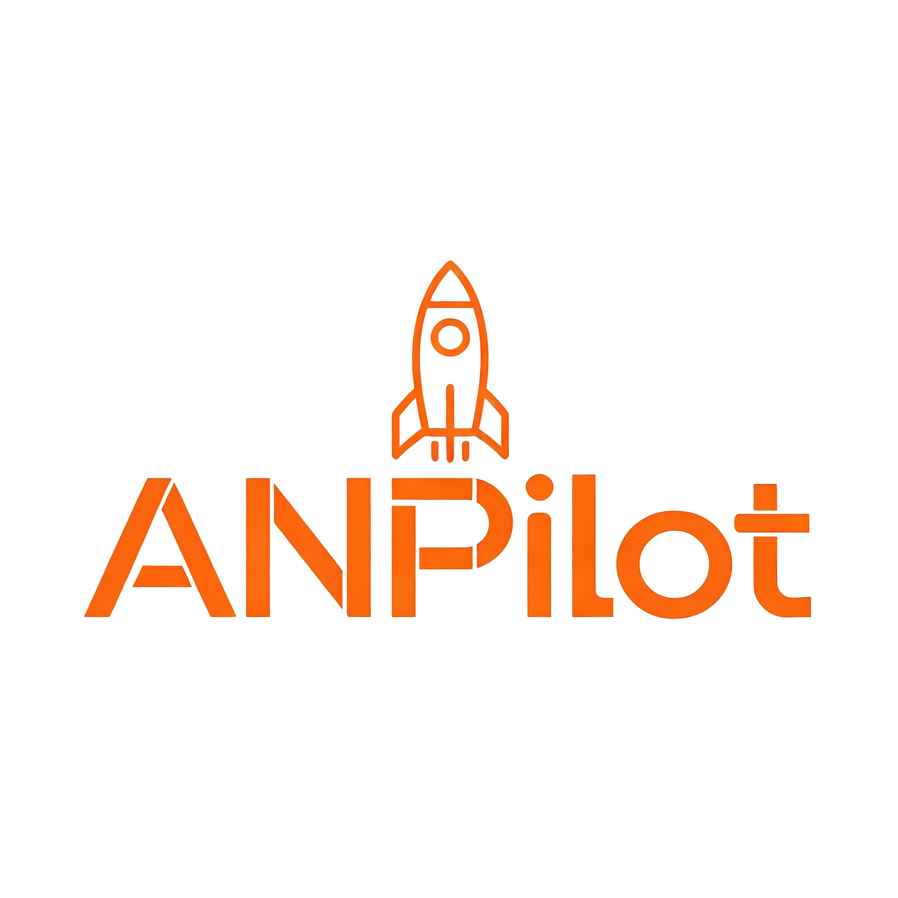

<h1 align="center"> ANPilotClient</h1>

ANPilotClient 是一个基于 Fabric 与 Kotlin 开发的 Minecraft 客户端 Mod，包含战斗、移动、渲染、HUD、玩家辅助和自动建造等模块

本项目主要用于个人学习、开发测试与客户端功能实验~
使用时请遵守目标服务器规则以及相关平台条款!

**我将保持更新和优化，欢迎各位提出优化建议，实现一端就可满足MC玩家的功能需要！**

## 链接

**B站主页**  [点击访问](https://b23.tv/QC32wv4) 

**个人网站**  [点击访问](AnMakerLab.cn) 

## 功能概览

| 主要功能 | 主要功能 | 主要功能 | 主要功能 |
| --- | --- | --- | --- |
| KillAura 击杀光环 | AutoBuild 自动建造 | AutoCrystal 自动水晶 | AutoTotem 自动图腾 |
| AutoMine 自动挖掘 | AutoTool 自动工具 | AutoEat 自动进食 | AutoFish 自动钓鱼 |
| AutoElytra 自动鞘翅 | AutoEnchant 自动附魔 | BaseFinder 基地搜索 | ElytraPilotPlus 鞘翅飞行 |
| FlyTo 坐标飞行 | XRay 矿物透视 | ESP 实体透视 | BlockESP 方块透视 |
| StorageESP 容器透视 | NameTags 名称标签 | Freecam 灵魂出窍 | ScaffoldPlus 自动搭路 |

## GUI 预览

| 主界面 | HUD界面                                                                                           |
| --- |-------------------------------------------------------------------------------------------------|
|  |  |

## 环境要求

- Minecraft `26.1.2`
- Java `25` 或更高版本
- Fabric Loader `0.19.2` 或更高版本
- Fabric API
- Fabric Language Kotlin

## 构建

Windows:

```powershell
.\gradlew.bat build
```

Linux / macOS:

```bash
./gradlew build
```

## 开发

推荐使用 IntelliJ IDEA 打开项目，并等待 Gradle 同步完成。

常用命令:

```powershell
.\gradlew.bat compileKotlin
.\gradlew.bat runClient
```

## 依赖

项目主要依赖:
- Fabric Language Kotlin
- Sodium
- Baritone API

## 许可证

本项目使用 GNU General Public License v3.0 only 授权，详见 `LICENSE`。

如果你分发本项目的修改版本或基于本项目的衍生作品，需要按照 GPL-3.0-only 的要求一并提供对应源码。

## 打赏支持

如果这个项目对你有帮助，可以支持一哈作者，哈哈~

| 收款码 | B站充电 |
| --- | --- |
|  | [点击前往 B站主页充电](https://b23.tv/QC32wv4) |
